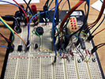
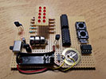
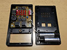

# Tea Timer with Arduino
A tea or egg timer, using an ATtiny85-20PU chip with Arduino, running from batteries.

The full article is coming soon.

## Schematics

## How to install code
- Download and install the [Arduino IDE](https://www.arduino.cc/en/software).
- The Arduino IDE by default stores all Sketches in a folder named **"Arduino"** in your **Documents** folder.
- Download the repository and copy the entire **"Tea_Timer_Tiny85"** folder to there.
- Start the Arduino IDE and select **"File"**, **"Sketches"**, and then choose **"Tea_Timer_Tiny85"** from the list.

## Photo Gallery
Here's my final implementation with box and everything.

 

## License
MIT