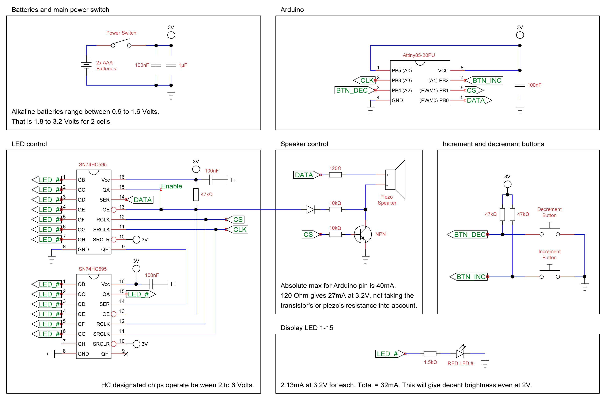
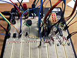
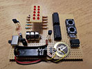
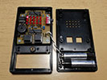

# Tea Timer with Arduino
A tea or egg timer, using an ATtiny85-20PU chip with Arduino, running from batteries.

You can of course buy a mechanical one, but they have some properties I did not like:
-   They have a very loud ticking noise, which is not ideal in an office environment.
-   They ring for only a split second, and then go silent. If you weren't listening, you could easily miss it, and left wondering whether it had already rang, or you forgot to wind it up in the first place.

My solution aims to fix these two problems. Since it's digital, there is no operational noise, and it will keep beeping until you manually turn it off. On top of that, it also flashes, so you can still see it if you're wearing headphones.

Of course, another alternative is to just use a mobile app for this, but apps are lame. Dedicated tools are the way to go. Think of it as a kitchen accessory that you keep in the kitchen.

## Schematics

## Technical details
Coming soon...

## How to install code
- Download and install the [Arduino IDE](https://www.arduino.cc/en/software).
- The Arduino IDE by default stores all Sketches in a folder named **"Arduino"** in your **Documents** folder.
- Download the repository and copy the entire **"Tea_Timer_Tiny85"** folder to there.
- Start the Arduino IDE and select **"File"**, **"Sketches"**, and then choose **"Tea_Timer_Tiny85"** from the list.

## Photo Gallery
Here's my final implementation with box and everything.

## License
MIT