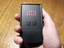

# Tea Timer with Arduino
A tea timer, or egg timer, using an ATtiny85-20PU chip with Arduino, running from batteries. You can of course buy a mechanical one, but I had some problems with those:
-   They have a very loud ticking noise, which is not ideal in an office environment.
-   They ring for only a split second and then go silent. If you weren't listening, you could easily miss it, and left wondering whether it had already rang, or you forgot to wind it up in the first place.

My solution aims to fix these two problems. Since it's digital, there is no operational noise, and it will keep beeping until you manually turn it off. On top of that, it also flashes, so you can still see it if you're wearing headphones.

Of course, another alternative is to just use a mobile app for this, but apps are lame. Dedicated tools are the way to go. Think of it as a kitchen accessory that you keep in the kitchen.

## Schematics

The `enable` pin can be skipped by wiring both `OE` inputs directly to ground. However, every time you switch the device on, the LEDs will be in a random state for a split second.

## Technical details
It uses the ATtiny85-20PU microchip, which has an operating Voltage of 1.8V to 5.5V. I'm using two AAA alkaline batteries, which together have a Voltage range between 1.8V to 3.2V during its usable lifetime.

Based on my calculations, this can last for at least 2 years, even for an avid tea drinker such as myself. I recommend using long-life batteries.

Since the chip runs directly from the battery without a voltage regulator, there's a slight time-dilation relative to the battery power. During the battery's lifetime it shifts from being 1 sec ahead for every minute, to 1 sec behind for every minute, and then it plummets as the battery dies.

To save more on battery life, you need very bright LEDs with a very large resistor value, so ultimately they won't shine that much, but they will consume much less.

## How to install code
### Arduino IDE and code
- Download and install the [Arduino IDE](https://www.arduino.cc/en/software).
- The Arduino IDE by default stores all Sketches in a folder named **"Arduino"** in your **Documents** folder.
- Download the repository and copy the entire **"Tea_Timer_Tiny85"** folder to there.
- Start the Arduino IDE and select **"File"**, **"Sketches"**, and then choose **"Tea_Timer_Tiny85"** from the list.

### Program ATtiny Board
ATtiny85 is not officially supported by Arduino, and needs third party Board plugin installed.
- Start the Arduino IDE and select **"Tools"**, **"Board"**, **"Boards Manager..."**.
- Then search for **"ATTinyCore"**.

For info on how to set up the chip's fuses, look at the beginning of the Arduino code.

## Photo Gallery
Here's my final implementation with box and everything.

It started as a test on a breadboard, and then I built it on a prototype board so I can test its usability in a real-life scenario. It went through several battery configurations before I settled on two AAA batteries.

The size is very ergonomic. The design is right-handed, so the main switch is at the top-right.

## License
MIT